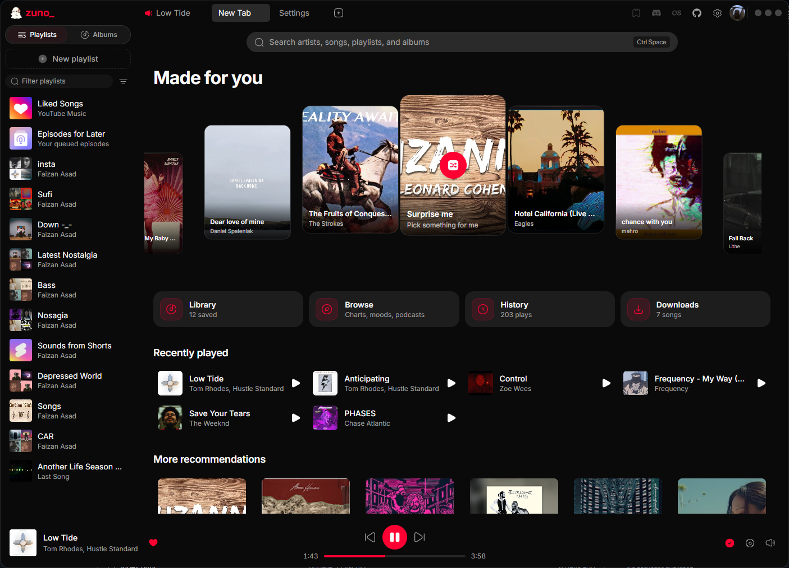
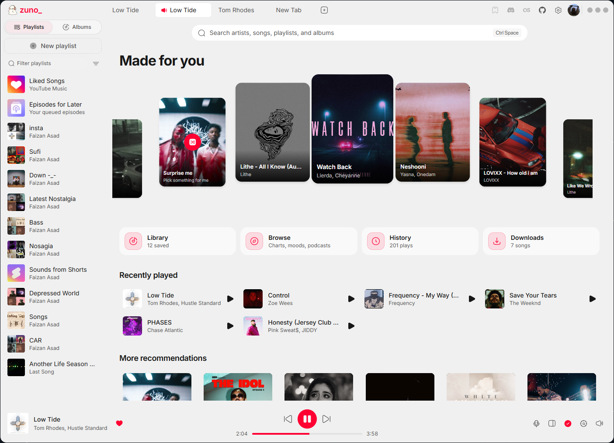
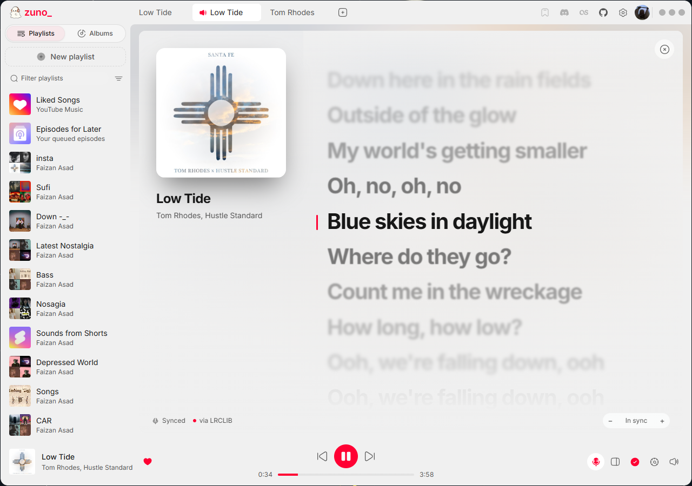
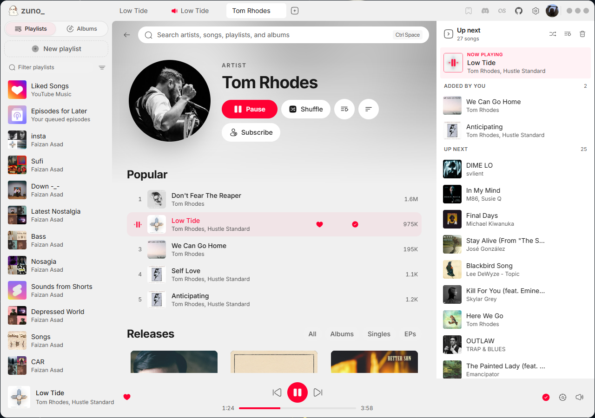
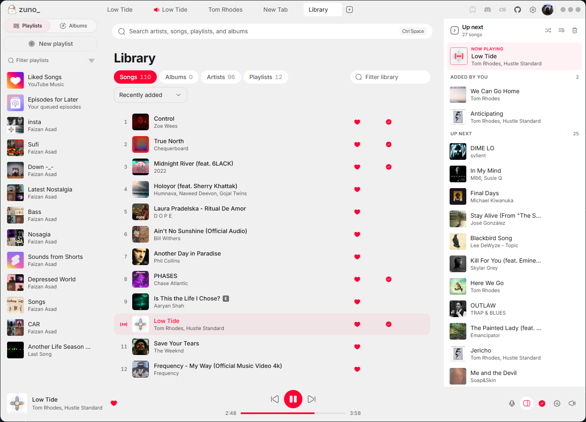
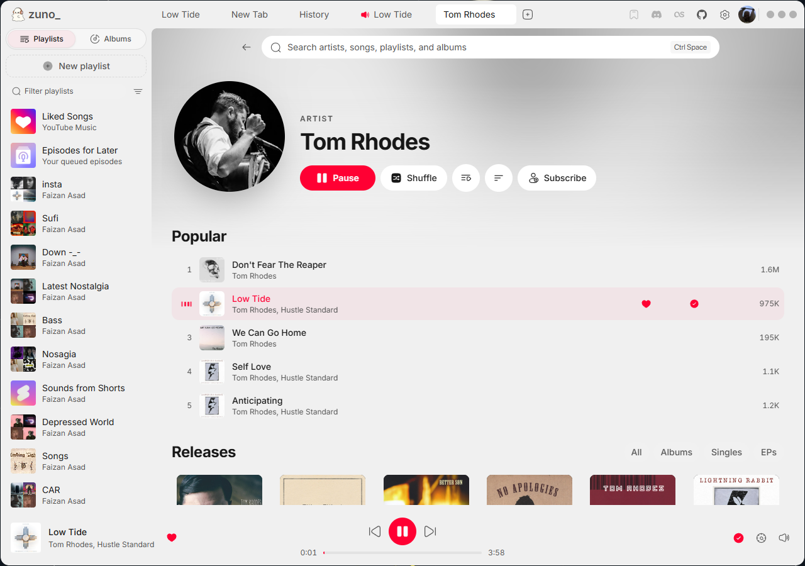
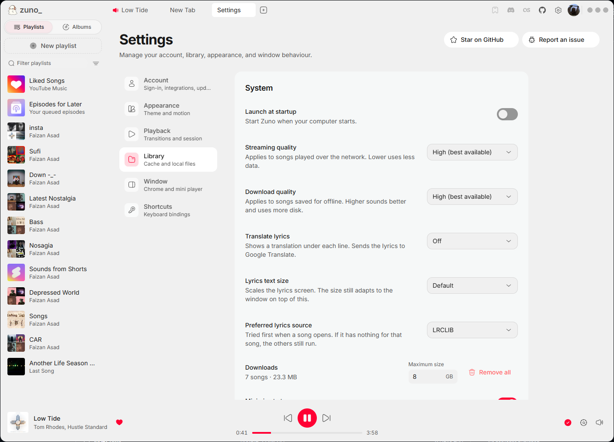

<p align="center">
  
</p>

<h1 align="center">Zuno</h1>

<p align="center">
  A fast, native-feeling desktop client for YouTube Music.<br />
  Built with Tauri, React and TypeScript for <b>Windows, macOS and Linux</b>.
</p>

<p align="center">
  <a href="https://github.com/noFAYZ/zuno/releases/latest"></a>
  <a href="https://github.com/noFAYZ/zuno/releases/latest"></a>
  <a href="https://github.com/noFAYZ/zuno/blob/main/LICENSE"></a>
  <a href="https://github.com/noFAYZ/zuno/stargazers"></a>
</p>

<p align="center">
  <picture>
    <source media="(prefers-color-scheme: dark)" srcset="assets/img/zuno-d1-1.2.PNG" />
    <source media="(prefers-color-scheme: light)" srcset="assets/img/zuno-l4-1.2.PNG" />
    
  </picture>
</p>

> [!IMPORTANT]
> Zuno is an independent, unofficial project. It is not affiliated with, authorized by,
> sponsored by, or endorsed by YouTube or Google.

<br />

## About

Zuno brings YouTube Music to the desktop as a focused application rather than a browser tab.
There is no official YouTube Music desktop client, so the goal here is a polished one that
feels native on each platform and stays fast with large libraries.

If you find it useful, **starring the repo** genuinely helps.

<br />

## Screenshots

<table>
  <tr>
    <td width="50%"><b>Home — dark</b></td>
    <td width="50%"><b>Home — light</b></td>
  </tr>
  <tr>
    <td></td>
    <td></td>
  </tr>
  <tr>
    <td colspan="2"><sub>The "Made for you" carousel, quick destinations and recently played. The carousel can be hidden from Settings.</sub></td>
  </tr>
</table>

<table>
  <tr>
    <td width="50%"><b>Lyrics — dark</b></td>
    <td width="50%"><b>Lyrics — light</b></td>
  </tr>
  <tr>
    <td></td>
    <td></td>
  </tr>
  <tr>
    <td colspan="2"><sub>Lines fade with distance from the one playing. Click any line to seek, nudge the timing if a match is a little off, and see which source the words came from.</sub></td>
  </tr>
</table>

<table>
  <tr>
    <td width="50%"><b>Artist — dark</b></td>
    <td width="50%"><b>Artist — light</b></td>
  </tr>
  <tr>
    <td></td>
    <td></td>
  </tr>
  <tr>
    <td colspan="2"><sub>Popular tracks and every release, filtered by albums, singles or EPs — with subscribe and shuffle in reach.</sub></td>
  </tr>
</table>

<table>
  <tr>
    <td width="50%"><b>Queue — dark</b></td>
    <td width="50%"><b>Library — light</b></td>
  </tr>
  <tr>
    <td></td>
    <td></td>
  </tr>
  <tr>
    <td colspan="2"><sub>The queue separates what you added by hand from what came next on its own. The library marks what is liked, downloaded and explicit at a glance.</sub></td>
  </tr>
</table>

<p align="center">
  
  <br />
  <sub>Search is one keystroke away — Ctrl+Space from anywhere, across artists, songs, playlists and albums.</sub>
</p>

<p align="center">
  
  <br />
  <sub>Settings — quality, lyrics source, translation and text size, downloads and the disk cap.</sub>
</p>

<br />

## Features

| Feature | Description |
|---|---|
| **Multiple tabs** | Each tab keeps its own queue, volume and player state — start an album in one, browse in another, and the first keeps playing |
| **Offline downloads** | Save a song, a selection, or a whole album or playlist, with its own quality setting and a size cap you control |
| **Mini player** | A morphing capsule that appears when you tab away; drag it anywhere, hover to expand |
| **Synced lyrics** | Line-by-line lyrics that follow the song — not available on the official web client. Click a line to jump to it, nudge the timing when a match is slightly off, and pick which source is tried first |
| **Lyrics translation** | Show a translation under each line, in any of twenty languages, with an adjustable text size |
| **Like & dislike** | Rate from the row, the player or the right-click menu; ratings sync to your YouTube Music account |
| **Batch actions** | Shift/ctrl-select rows, then queue, download, add to a playlist or remove them together |
| **Queue control** | Collapses to an artwork rail — end the queue here, build a queue from here, shuffle, clear |
| **Recommendations** | Personalised suggestions plus a "surprise me" shuffle — hide the carousel if you would rather open on your library |
| **Browse** | Explore, charts, moods and genres, and podcasts, with mood chips you can drill into |
| **Local files** | Folders from your own machine sit alongside your library, with a tag editor for fixing metadata |
| **Discord & Last.fm** | Rich Presence and scrobbling, each toggleable straight from the toolbar |
| **Account support** | Sign in with Google for your library and playlists, and switch between channels on the same account |
| **Playlist import/export** | Save a playlist to a file and bring it back, on this machine or another |
| **Desktop integration** | Media keys, minimise to tray, launch at login, remembered window position, rebindable shortcuts |
| **Light & dark themes** | Follows the OS by default, or pin either one — plus a reduced-motion mode |
| **Caching** | Playlists, lyrics and artwork are cached, so revisits are instant |
| **Auto-updates** | Signed updates install themselves; no manual re-download |

<br />

## Download

Grab the newest installer from the **[latest release](https://github.com/noFAYZ/zuno/releases/latest)**
for Windows, macOS or Linux.

<br />

## Platform support

- **Windows** — primary supported platform.
- **macOS** — supported.
- **Linux** — supported.

### Linux notes

Install the `.deb` or `.rpm`, or `zuno-bin` from the AUR on Arch. These use your system's
WebKitGTK and GStreamer, which is what playback runs through.

**No sound, or "YouTube player error 5".** Playback decodes through GStreamer, and most
distros do not install the codecs YouTube needs by default:

```bash
# Debian, Ubuntu, Mint
sudo apt install gstreamer1.0-libav gstreamer1.0-plugins-base gstreamer1.0-plugins-good

# Fedora (gstreamer1-libav needs RPM Fusion enabled)
sudo dnf install gstreamer1-libav gstreamer1-plugins-base gstreamer1-plugins-good

# Arch — pulled in automatically by zuno-bin
sudo pacman -S gst-libav gst-plugins-base gst-plugins-good
```

Confirm they registered:

```bash
gst-inspect-1.0 | grep -E 'avdec_aac|avdec_h264'
```

**A blank grey window.** A WebKitGTK rendering problem under Wayland, most often on Nvidia.
Launch with one of:

```bash
WEBKIT_DISABLE_DMABUF_RENDERER=1 zuno
WEBKIT_DISABLE_COMPOSITING_MODE=1 zuno
GDK_BACKEND=x11 zuno
```

Open the app log from **Settings → Library → Application log** for anything else, and attach
it to an issue. The desktop environment, display server and distro all help a lot for Linux
bugs. The log also lives at `~/.local/share/com.zuno.desktop/logs/current.log`.

### macOS notes

macOS may show a Keychain prompt. Zuno stores one encryption key in its own Keychain entry,
and your YouTube Music session is encrypted with that key before being written to the app
data directory. Choosing **Always Allow** avoids repeated prompts.

If you do not intend to sign in to YouTube Music, you can decline it.

<br />

## For developers

### Prerequisites

- Node.js LTS and npm
- [Rust and Cargo](https://rustup.rs/)
- C++ build tools (MSVC on Windows)
- Microsoft Edge WebView2 Runtime (Windows)

The Tauri CLI ships in the project's dev dependencies — no global install needed.

### Install, run, build

```bash
npm install
npm run tauri dev
npm run tauri build
```

### Architecture

The `docs/` folder documents the codebase:

- [`docs/architecture.md`](docs/architecture.md) — system overview and module map
- [`docs/frontend.md`](docs/frontend.md) — React structure, styling tokens, icon conventions
- [`docs/backend.md`](docs/backend.md) — Rust commands and the IPC surface

### Contributing

Contributions are welcome. Fork the repo, branch, test locally, and open a pull request
describing what changed and why. For larger changes, open an issue first so the approach can
be discussed.

By contributing you agree to the [Contributor License Agreement](CLA.md).

<br />

## Credits

Zuno is a fork of **[JustAnotherMusicClient](https://github.com/2latemc/JustAnotherMusicClient)**
by [2latemc](https://github.com/2latemc), used under the Apache 2.0 licence. The original
project did the hard groundwork of getting YouTube Music working on the desktop.

If you want to support the original author, they accept donations
[on Ko-fi](https://ko-fi.com/totally2late).

<br />

## Legal

**Zuno provides no downloading functionality.** It is a client for audio listening, with
theming and interface additions.

Zuno interacts with YouTube and YouTube Music. Access to those services remains governed by
their own terms, policies, availability and regional restrictions.

Zuno does not host or claim ownership of music, videos, artwork, metadata, or any other
content supplied by third parties. Rights in that content remain with their respective
owners.

The project is not intended to circumvent access controls, geographic restrictions,
advertising, paid service requirements, or content licensing, nor to enable unauthorised
downloading, copying, redistribution or public performance of third-party content.

YouTube and YouTube Music are trademarks of Google LLC. All other trademarks are the property
of their respective owners. References to third-party products describe compatibility and
integration only.

- [YouTube Terms of Service](https://www.youtube.com/static?template=terms)
- [YouTube API Services Terms of Service](https://developers.google.com/youtube/terms/api-services-terms-of-service)
- [YouTube API Services Developer Policies](https://developers.google.com/youtube/terms/developer-policies)
