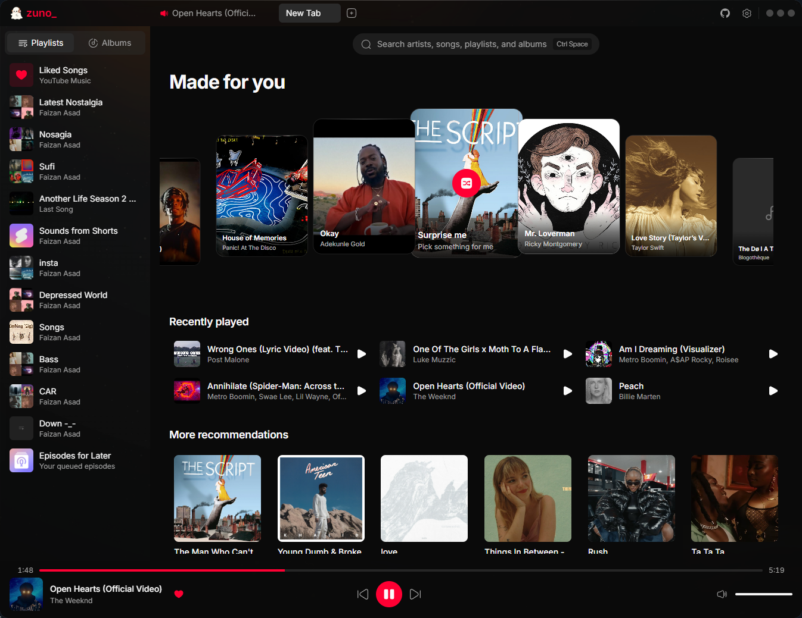
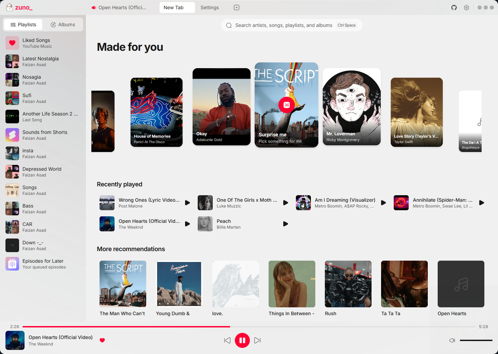
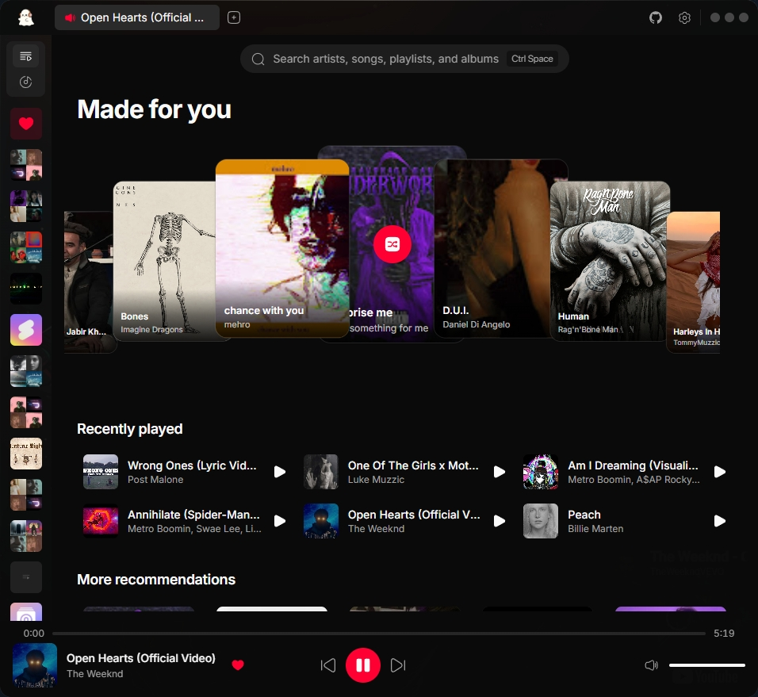

<p align="center">
  
</p>

<h1 align="center">Zuno</h1>

<p align="center">
  A fast, native-feeling desktop client for YouTube Music.<br />
  Built with Tauri, React and TypeScript for <b>Windows, macOS and Linux</b>.
</p>

<p align="center">
  <a href="https://github.com/noFAYZ/zuno/releases/latest"></a>
  <a href="https://github.com/noFAYZ/zuno/releases/latest"></a>
  <a href="https://github.com/noFAYZ/zuno/blob/main/LICENSE"></a>
  <a href="https://github.com/noFAYZ/zuno/stargazers"></a>
</p>

<p align="center">
  <picture>
    <source media="(prefers-color-scheme: dark)" srcset="docs/zuno-d.PNG" />
    <source media="(prefers-color-scheme: light)" srcset="docs/zuno-l.PNG" />
    
  </picture>
</p>

> [!IMPORTANT]
> Zuno is an independent, unofficial project. It is not affiliated with, authorized by,
> sponsored by, or endorsed by YouTube or Google.

<br />

## About

Zuno brings YouTube Music to the desktop as a focused application rather than a browser tab.
There is no official YouTube Music desktop client, so the goal here is a polished one that
feels native on each platform and stays fast with large libraries.

If you find it useful, **starring the repo** genuinely helps.

<br />

## Screenshots

<table>
  <tr>
    <td width="50%"><b>Dark</b></td>
    <td width="50%"><b>Light</b></td>
  </tr>
  <tr>
    <td></td>
    <td></td>
  </tr>
</table>

<p align="center">
  
  <br />
  <sub>Collapsed sidebar — the library rail stays reachable while the content column takes the width.</sub>
</p>

<br />

## Features

| Feature | Description |
|---|---|
| **Multiple tabs** | Each tab keeps its own queue, volume and player state |
| **Cylinder carousel** | "Made for you" picks roll through a 3D shelf rather than sitting in a grid |
| **Light & dark themes** | Follows the OS by default, or pin either one |
| **Mini player** | A morphing capsule that appears when you tab away; drag it anywhere, hover to expand |
| **Synced lyrics** | Real-time synced lyrics, not available on the official web client |
| **Caching** | Playlists, lyrics and artwork are cached, so revisits are instant |
| **Recommendations** | Personalised suggestions plus a "surprise me" shuffle |
| **Discord Rich Presence** | Shows what you are listening to on Discord |
| **Last.fm** | Scrobbling and now-playing updates |
| **Account support** | Sign in for your library, playlists and recommendations |
| **Song management** | Add to playlists or queue from anywhere, via right-click or keyboard |
| **Local files** | Build playlists from folders on your own machine |

<br />

## Download

Grab the newest installer from the **[latest release](https://github.com/noFAYZ/zuno/releases/latest)**
for Windows, macOS or Linux.

<br />

## Platform support

- **Windows** — primary supported platform.
- **macOS** — supported.
- **Linux** — supported.

### Linux notes

On some Wayland desktops the AppImage can open a blank grey window with an EGL error. If that
happens, try:

```bash
LD_PRELOAD=/usr/lib/libwayland-client.so ./Zuno_<version>_amd64.AppImage
```

If playback or window controls still fail, open the app log from **Settings → Library →
Application log** and attach it to an issue. The desktop environment, display server and
distro all help a lot for Linux bugs.

### macOS notes

macOS may show a Keychain prompt. Zuno stores one encryption key in its own Keychain entry,
and your YouTube Music session is encrypted with that key before being written to the app
data directory. Choosing **Always Allow** avoids repeated prompts.

If you do not intend to sign in to YouTube Music, you can decline it.

<br />

## For developers

### Prerequisites

- Node.js LTS and npm
- [Rust and Cargo](https://rustup.rs/)
- C++ build tools (MSVC on Windows)
- Microsoft Edge WebView2 Runtime (Windows)

The Tauri CLI ships in the project's dev dependencies — no global install needed.

### Install, run, build

```bash
npm install
npm run tauri dev
npm run tauri build
```

### Architecture

The `docs/` folder documents the codebase:

- [`docs/architecture.md`](docs/architecture.md) — system overview and module map
- [`docs/frontend.md`](docs/frontend.md) — React structure, styling tokens, icon conventions
- [`docs/backend.md`](docs/backend.md) — Rust commands and the IPC surface

### Contributing

Contributions are welcome. Fork the repo, branch, test locally, and open a pull request
describing what changed and why. For larger changes, open an issue first so the approach can
be discussed.

By contributing you agree to the [Contributor License Agreement](CLA.md).

<br />

## Credits

Zuno is a fork of **[JustAnotherMusicClient](https://github.com/2latemc/JustAnotherMusicClient)**
by [2latemc](https://github.com/2latemc), used under the Apache 2.0 licence. The original
project did the hard groundwork of getting YouTube Music working on the desktop.

If you want to support the original author, they accept donations
[on Ko-fi](https://ko-fi.com/totally2late).

<br />

## Legal

**Zuno provides no downloading functionality.** It is a client for audio listening, with
theming and interface additions.

Zuno interacts with YouTube and YouTube Music. Access to those services remains governed by
their own terms, policies, availability and regional restrictions.

Zuno does not host or claim ownership of music, videos, artwork, metadata, or any other
content supplied by third parties. Rights in that content remain with their respective
owners.

The project is not intended to circumvent access controls, geographic restrictions,
advertising, paid service requirements, or content licensing, nor to enable unauthorised
downloading, copying, redistribution or public performance of third-party content.

YouTube and YouTube Music are trademarks of Google LLC. All other trademarks are the property
of their respective owners. References to third-party products describe compatibility and
integration only.

- [YouTube Terms of Service](https://www.youtube.com/static?template=terms)
- [YouTube API Services Terms of Service](https://developers.google.com/youtube/terms/api-services-terms-of-service)
- [YouTube API Services Developer Policies](https://developers.google.com/youtube/terms/developer-policies)
