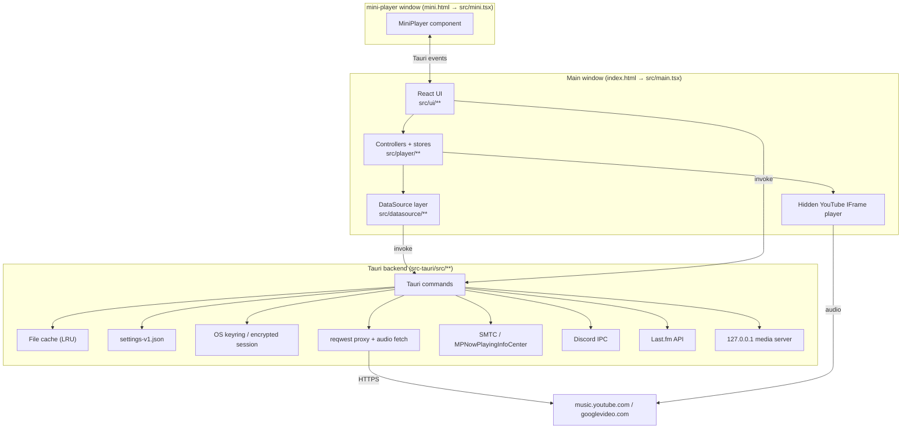

# Architecture — Zuno

An unofficial desktop YouTube Music client. Tauri 2 (Rust) shell + React 19 / TypeScript
front end, bundled by Vite 7. No router and no Redux — plain classes with `useSyncExternalStore`
and direct Tauri IPC. The UI is built on Tailwind v4 plus animated components vendored from the
[beUI](https://beui.dev) registry, with [Solar](https://solar-icons.vercel.app) icons.

- Version: `1.2.81` (`package.json`, `src-tauri/Cargo.toml`, `src-tauri/tauri.conf.json` are kept in lockstep)
- Bundle id: `com.justanothermusicclient.desktop`
- Platforms: Windows, macOS, Linux
- Companion docs: [frontend.md](./frontend.md) (UI), [backend.md](./backend.md) (Rust/IPC)

---

## 1. Big picture



Three rules explain most of the design:

1. **All network traffic to Google goes through Rust** (`proxy_http_request`) so the WebView's
   CORS/cookie rules never apply and cookie auth can be signed properly.
2. **Audio is played by YouTube's own IFrame player**, not by `<audio>` — this dodges the 403s
   that signed googlevideo URLs return when replayed from a different context. Native `<audio>`
   is used only for local files and as a fallback path.
3. **Every piece of durable state has two homes**: `localStorage` (synchronous, drives the UI)
   and a Rust-owned JSON file (survives WebView data wipes). See §6.

---

## 2. Process and window model

| Window | Label | Entry | Notes |
|---|---|---|---|
| Main | `main` | `index.html` → `src/main.tsx` | 1280×800, min 900×600, `decorations: false` (custom title bar; Linux forces decorations on at runtime) |
| Mini player | `mini-player` | `mini.html` → `src/mini.tsx` | 160×80, transparent, always-on-top, `skipTaskbar`, hidden until the main window loses focus |
| Sign-in | `youtube-music-login` | Google sign-in URL | Created on demand by Rust during `sign_in_youtube_music`, destroyed after the session cookie appears |

Vite is configured with two Rollup inputs (`vite.config.ts`), so main and mini ship as separate
HTML entry points sharing the same module graph.

**Production frontend hosting is unusual.** In release builds `run()` picks a free port, serves
`dist/` through `tauri-plugin-localhost`, and rewrites `frontend_dist` to `http://localhost:<port>`.
The YouTube IFrame API refuses to run under the `tauri://` / `asset://` origins, so the app needs a
real `http://` origin. Dev builds use the normal Vite dev server on port 1420.

**Window events → frontend:**

| Event | Emitted when | Consumed by |
|---|---|---|
| `main-window-backgrounded` | main window loses focus and mini player isn't focused (100 ms debounce) | `App.tsx` — shows the mini player |
| `window-focused` | main window regains focus | `App.tsx` — hides the mini player, triggers connection recovery |
| `windows-media-control` | SMTC button pressed | `useMediaSession` |

Mini ↔ main communication is a set of plain Tauri events (`emit`/`listen`) carrying player status,
time, and volume snapshots; the mini window holds no controllers of its own.

---

## 3. Layers

```
src/
├─ main.tsx / mini.tsx      bootstrap: settings hydration, error hooks, React root
├─ internal/                cross-cutting: cache, app settings, logging, updater
├─ datasource/              "where does music come from" — abstract API + YouTube Music impl
├─ player/                  playback engine, queue, tabs, library, integrations
├─ components/              vendored beUI primitives (registry paths, do not restructure)
├─ lib/                     beUI helpers: cn, ease tokens, use-hover-capable
└─ ui/                      app components, pages, settings modules, stores, icons.tsx
```

Dependency direction is strictly downward: `ui → player → datasource → internal → Tauri IPC`.
Nothing in `datasource/` imports from `ui/`.

### 3.1 `internal/` — cross-cutting utilities

| Module | Responsibility |
|---|---|
| `cache.ts` | Thin wrapper over the Rust file cache (`cache_get/set/stats/clear`). JSON in, JSON out. Default budget 4 GiB. |
| `appSettings.ts` | `app_setting_get/set/remove` + `app_settings_clear`. Never throws (except `clear`). |
| `durableLocalSetting.ts` | The localStorage ⇄ durable-settings mirroring helpers (`readLocal*`, `writeLocal*`, `hydrateLocal*`). Every settings module in `ui/settings/` is built on these. |
| `logging.ts` | `logInternalDebug/Info/Warn/Error`. Redacts cookies, tokens, authorization headers and full URLs before forwarding to Rust via `frontend_log`, then also mirrors to the console. |
| `updateChecker.ts` | `tauri-plugin-updater` wrapper; on macOS it degrades to a GitHub Releases API check (notify-only, no in-app install). 24 h per-version snooze in localStorage. |

### 3.2 `datasource/` — content abstraction

`DataSource` (`datasource/DataSource.ts`) is an abstract class where *everything except
`getTrack` and `getStreamUrl` is optional*. Controllers feature-detect (`this.dataSource.getLyrics?.(…)`),
so a partial implementation degrades gracefully instead of crashing.

Domain types live in `datasource/types.ts`: `Track`, `Album`, `Playlist`, `Artist`, `ArtistPage`,
`SearchResults`, `TrackPage`, `Lyrics`, `LibrarySnapshot`, `AuthPrompt`. `Track.source` is
`"youtube" | "local"` — the single discriminator that routes local files down a different
playback path.

| File | Role |
|---|---|
| `youtube/YouTubeMusicDataSource.ts` | **The only implementation wired up.** ~4.2k lines. Owns Innertube clients, library/playlist/album/artist fetching, search, recommendations, likes, lyrics, and stream resolution. |
| `youtube/tauriFetch.ts` | `fetch`-shaped adapter that funnels youtubei.js through `proxy_http_request`. Computes the `SAPISIDHASH` authorization header, sets `origin`/`referer` to `music.youtube.com`, and rewrites `www.youtube.com/youtubei/*` → `music.youtube.com` when the client id is `67` (YouTube Music). |
| `youtube/artwork.ts` | Walks arbitrary Innertube response objects collecting `{url,width,height}` candidates and picks the largest; plus `i.ytimg.com` fallbacks by video id. |
| `youtube/YouTubeDataSource.ts` | **Dead code.** Older non-Music implementation, no longer imported anywhere (see §9). |

Caching inside the data source is a consistent stale-while-revalidate pattern:

```
getX() → read cache → if usable, return it and kick off a background refresh
                    → else await refresh, write cache, return
refresh promises are deduped per key in a Map so concurrent callers share one request
```

Cache keys are versioned strings (`youtube-music:library:v5`, `youtube-music:track:v1:<id>`,
`lyrics:synced:v2:<id>`, …); bumping the version is how you invalidate a schema change.

### 3.3 `player/` — playback and app state

| Module | Responsibility |
|---|---|
| `AudioEngine.ts` | Owns one hidden YouTube IFrame player (200×200, `opacity: 0.01`, `pointer-events: none`) plus an optional `HTMLAudioElement`. Handles cue/play state machines with timeouts and per-request cancellation. A module-level `playbackClaimId` + `playbackOwner` pair guarantees only one engine makes sound at a time. |
| `Queue.ts` | Pure queue data structure with three regions: played/current, a **manual queue** segment (`playNext` / `addToQueue`), and automatic upcoming tracks. Shuffle only touches the automatic region and remembers the original order so it can be restored. |
| `PlayerController.ts` | One per tab. Orchestrates DataSource → AudioEngine → Queue, playback order modes (`in-order` / `shuffle` / `repeat-one`), radio/autoplay refills, history, error surfacing, session export/restore, and Discord presence updates. |
| `TabManager.ts` | Owns the `Map<tabId, PlayerController>`. Distinguishes the **focused** tab (what you're looking at) from the **playback owner** (what's making sound), and suspends/resumes engines on switch. |
| `playerStore.ts` | Composition root: constructs the data source and the three controllers, restores the persisted session, and exposes `usePlayerState` / `usePlayerSession` / `useLibraryState` hooks plus an `ActivePlayerController` facade that always targets the right tab. |
| `LibraryController.ts` | Sign-in/out, library snapshot loading with a 20 s timeout and post-sign-in retries, optimistic like/save mutations with rollback, and local-playlist merging. |
| `SearchController.ts` | Trims queries, falls back from `search` to `searchTracks`, forwards streaming `onUpdate` callbacks. |
| `localPlaylists.ts` | Local-file playlists: folder paths, per-playlist added tracks, ordering — all in localStorage, resolved through `local_audio_scan`. |
| `recentPlaylists.ts` | Last-played timestamps per playlist for sidebar ordering. |
| `playbackSettings.ts` | Volume/mute, mirrored to durable settings. |
| `appSession.ts` | Whole-app session snapshot in localStorage (`yt-music-dock.app-session.v1`): tabs + per-tab player sessions. Restores `playing` as `paused` so launching the app never autoplays. |
| `DiscordRPC.ts` | Sanitizes presence payloads (128-char text limit, HTTPS-only artwork from a trusted host allowlist) before invoking Rust. |
| `LastFm.ts` | Tracks listened seconds, sends `nowPlaying` once per track and scrobbles at `min(240 s, duration/2)`; tracks shorter than 31 s never scrobble. |
| `useMediaSession.ts` | Bridges player state to Windows SMTC (via `update_windows_media_session` + `windows-media-control` events) or, elsewhere, the WebView `navigator.mediaSession`. |
| `shuffleTracks.ts` | Fisher–Yates helper. |
| `Recommender.ts` | **Dead code** — returns `[]`, nothing imports it. |

### 3.4 `ui/` — React

Detailed in [frontend.md](./frontend.md). Summary: `App.tsx` is the single stateful root
(tabs, navigation history, onboarding, updates, window/mini-player wiring, global shortcuts);
everything else is presentational or reads a store hook directly.

### 3.5 `src-tauri/src/` — Rust

Detailed in [backend.md](./backend.md).

| File | Responsibility |
|---|---|
| `main.rs` | Sets the Windows AppUserModelID, strips the WebView2 diagnostics env var, calls `run()` |
| `lib.rs` (~2.4k lines) | Commands, cache, settings, logging, keyring/session, HTTP proxy, audio fetch, local media server, window event wiring |
| `discord_rpc.rs` | `DiscordIpcClient` lifecycle and activity building |
| `lastfm.rs` | MD5-signed Last.fm API calls, session in keyring |
| `windows_media.rs` | SMTC integration + taskbar thumbnail toolbar buttons |
| `macos_media.rs` | `MPNowPlayingInfoCenter` integration |

---

## 4. Key flows

### 4.1 Boot

```
main.tsx
  applyPlatformAttributes()          → data-platform-linux on <html>
  applyPaperPcMode()                 → data-paper-pc (reduced-motion / no blur theme)
  applyNativeWindowControls()        → window decorations on/off
  hydrateMainWindowGeometry() → restoreMainWindowGeometry()
  Promise.all([ hydrate* for paperPc, windowControls, miniPlayer, playerControls,
                lastFm, keyboardShortcuts, playbackSettings ])
  DiscordRpcService.init()
  window error / unhandledrejection hooks
  ReactDOM.createRoot(...).render(<App/>)

playerStore.ts (module side effect, imported by App)
  new YouTubeMusicDataSource()
  new LibraryController / SearchController / TabManager
  loadAppSession() → tabManager.restoreSession(...)  (or create tab "1")

App mount
  libraryController.initialize() → cached library first, then restoreSession() + refresh()
  loading screen dismisses after ≥1 s, ≤4 s
```

Hydration order matters: durable settings are read from Rust *after* the synchronous
localStorage read, so the UI paints instantly with the last known values and corrects itself
once the file read resolves.

### 4.2 Playing a track

```
UI onClick
  → playerController.playTrackById(videoId, queue?, autoplayWhenQueueEnds?)
  → tabManager.claimFocusedPlayer()      (suspends the previous playback owner)
  → PlayerController.playTrackById
       queue.set(playbackQueue, startIndex)          isPlaylistMode = queue>1 && !autoplay
       dataSource.getTrack(videoId)                  cached, merged with the queued row
       ensureTrackLoaded(track)
          local  → getStreamData() → local_audio_read → <audio> via loadNativeFallback
          remote → audioEngine.loadTrack(videoId)  → IFrame cueVideoById + wait for CUED
       audioEngine.play()                            claims global playback, waits for PLAYING
       setState({status:"playing"})
  → emit() → React re-render + Discord presence update
```

Track end (`onEnded`) → `handleTrackEnded`: repeat-one replays; otherwise the next queue item;
otherwise queue-end recommendations (playlist mode); otherwise the radio queue if autoplay is on;
otherwise pause. `refillAutomaticQueue()` tops the automatic region back up when fewer than 10
tracks remain and the queue isn't a fixed playlist.

Every async step is guarded by a monotonically increasing request id (`playTrackRequestId`,
`radioQueueRequestId`, `loadRequestId`), so a fast skip cancels the in-flight work rather than
letting a stale response overwrite state.

### 4.3 Stream resolution

| Track kind | Path |
|---|---|
| YouTube, normal | No stream URL is fetched at all — the IFrame player handles it from the video id. |
| YouTube, native fallback (`getStreamData`) | Innertube `getBasicInfo` → best `audio/mp4` adaptive format → decipher → `fetch_audio_source` downloads it in Rust, verifies the `ftyp` box, and re-serves it from a local `127.0.0.1` HTTP server so the WebView can stream it without CORS or signed-URL issues. |
| Local file | `local_audio_read` returns base64 bytes + a MIME type guessed from the extension; the frontend builds a `Blob` object URL. |

`shouldUseNativeAudio()` currently returns `false` unconditionally — the native path is reachable
only via `loadNativeFallback` (local files). The comment in `AudioEngine.ts` records why: the
backend download path returned 403s, so v1.2.65 reverted every platform to the IFrame player.

### 4.4 Authentication

Cookie-based, not OAuth:

```
signIn()
  → Rust sign_in_youtube_music
      opens the "youtube-music-login" window at accounts.google.com
      clear_all_browsing_data() first
      polls once a second, up to 300 s, for cookies on music.youtube.com
      success = has SAPISID|__Secure-1PAPISID|__Secure-3PAPISID AND the window is on music.youtube.com
      serializes them into one Cookie header, persists, closes the window, returns the header
  → frontend clears the data cache, rebuilds the Innertube client, refreshes the library
```

Storage differs by OS: Windows/Linux split the header into ≤900-byte chunks across up to 16 keyring
entries plus a `chunks:<n>` manifest (keyrings cap entry size); macOS encrypts the header with
AES-256-GCM into `youtube-music-session-v1.bin` under the app data dir and keeps only the 32-byte
key in the keychain. The keyring service name is still the legacy `com.ytmusicdock.app` so existing
sign-ins survived the rename.

After sign-in `LibraryController` retries the library fetch up to three times (0 / 1.5 s / 5 s)
because YouTube's library endpoints briefly return empty right after the session is created.

### 4.5 Search

`SearchOverlay` (Ctrl/⌘+K) does three things at once: fuzzy-matches your own playlists and albums
locally, requests `getSearchSuggestions`, and on submit opens a `search` view (optionally in a new
tab). `SearchResultsPage` renders the mixed `SearchResults` (artists / tracks / albums / playlists),
with streaming `onUpdate` callbacks painting partial results as they arrive.

---

## 5. State management

No state library. Three patterns, in order of preference:

1. **Class + listener set + `useSyncExternalStore`** — `TabManager`, `LibraryController`,
   `playerUIStore`. Subscribers get a `getSnapshot` that must return a stable reference; controllers
   cache their snapshot (`activeSessionSnapshot`) and invalidate it on `emit()`.
2. **localStorage + custom `window` event + `useSyncExternalStore`** — every module under
   `ui/settings/`. The event name (e.g. `mini-player-enabled-change`) is the change channel, and the
   `storage` event covers the other window.
3. **`useState` in `App.tsx`** — tabs, navigation history, onboarding, update toast. Tab state is
   pure React; only the per-tab `PlayerController` lives outside React.

### The focused-vs-owner split

`TabManager` tracks `activeId` (focused tab) and `playbackOwnerId` (audible tab) separately, and
`getEffectivePlayer()` resolves them: if the focused tab has a current track it wins, otherwise the
playback owner does. This is what lets you browse tab 2 while tab 1 keeps playing, and it is why the
`playerController` exported from `playerStore` is a facade — read methods hit the effective player,
while `loadTrack`/`playTrackById` first *claim* the focused tab as the new owner.

---

## 6. Persistence

| Store | Location | Contents |
|---|---|---|
| Durable app settings | `<app_data_dir>/settings-v1.json` (Rust, mutex-guarded) | Mirror of every UI setting: theme flags, shortcuts, window geometry, mini-player position, sidebar order, onboarding flags |
| localStorage | WebView profile | Same settings (fast path) + session, local playlists, recent playlists, recent searches, update snoozes |
| Data cache | `<app_cache_dir>/data-cache-v1/entries/<fnv1a>.json` | Library, playlists, albums, artists, tracks, lyrics, search results. LRU-evicted to a configurable budget (default 4 GiB) |
| Secrets | OS keyring (`com.ytmusicdock.app`) — plus an AES-GCM file on macOS | YouTube cookie header, Last.fm session key |
| Logs | `<app_log_dir>/current.log` | Truncated on every launch; older `*.log` files deleted |

"Delete all app data" in Settings clears all five: `clearAppSettings()`, `clearCache()`,
`clearAppSession()`, `localStorage.clear()`, plus sign-out.

---

## 7. Platform integrations

| Integration | Where | Notes |
|---|---|---|
| Discord Rich Presence | `player/DiscordRPC.ts` → `discord_rpc_update` / `_clear` → `discord_rpc.rs` | Client id `1515682467154100344`. Timestamps derived from position so Discord shows a live progress bar. Artwork is forced to `i.ytimg.com/vi/<id>/hqdefault.jpg` for YouTube tracks because Google CDN hosts block Discord's fetcher. |
| Last.fm | `player/LastFm.ts` → `lastfm_*` → `lastfm.rs` | Desktop auth-token flow opened in the system browser; session key in the keyring; MD5 `api_sig` computed in Rust. |
| Windows SMTC | `windows_media.rs` | `MediaPlayer`/`SystemMediaTransportControls` for the OS overlay, plus taskbar thumbnail toolbar buttons. Sends `windows-media-control` events back to JS. |
| macOS Now Playing | `macos_media.rs` | `MPNowPlayingInfoCenter` via `objc2`. Requires `macOSPrivateApi: true`. |
| Other platforms | `useMediaSession.ts` | Falls back to `navigator.mediaSession` with metadata, position state, and action handlers. |
| Autostart | `ui/settings/autostart.ts` | `tauri-plugin-autostart`. |
| Updates | `internal/updateChecker.ts` | `tauri-plugin-updater`, minisign-signed, endpoints on GitHub Releases (`latest.json`) and an `updater-channel` branch. macOS is notify-only. |

---

## 8. Build, release, security

**Build:** `npm run dev` (Vite only) · `npm run tauri dev` · `npm run tauri build`
(runs `tsc && vite build` first via `beforeBuildCommand`). Bundle targets: `all`,
with updater artifacts enabled. CI lives in `.github/workflows/release.yml`.

**Security posture:**

- `app.security.csp` is `null` — no CSP is enforced. Needed because the app loads the YouTube
  IFrame API from `youtube.com` at runtime; worth revisiting if that path ever changes.
- `src-tauri/capabilities/default.json` allowlists every command and window permission explicitly.
  A new `#[tauri::command]` must be added there or the frontend can't call it.
- Log sanitization happens twice: `internal/logging.ts` redacts before sending, and Rust's
  `sanitize_log_message` redacts again before writing to disk.
- Discord and artwork URLs are validated against host allowlists before leaving the app.
- Signed `googlevideo.com` URLs carry an `ip=` parameter; the Rust client binds its local address
  to the matching IP family so the signature stays valid.

---

## 9. Known dead code and rough edges

Recorded so nobody re-derives them:

- `src/datasource/youtube/YouTubeDataSource.ts` (809 lines) — superseded by `YouTubeMusicDataSource`, not imported.
- `src/player/Recommender.ts` — stub returning `[]`, not imported. Recommendations live in the data source.
- `src/ui/components/player/ExpandedPlayerBar.tsx` — migrated to Tailwind so it compiles, but its
  render block is still commented out in `App.tsx`; the `isExpandedPlayerBar` state and toggle are live.
- `greet` command in `lib.rs` — Tauri scaffolding leftover, still allowlisted.
- `AudioEngine.shouldUseNativeAudio()` is hardcoded `false`; the native/`fetch_audio_source` path and `fetch_youtube_music_audio` exist but are only reachable for local files.
- `App.tsx` is 1717 lines with ~25 `useEffect` blocks, several written at zero indentation (lines 1340+) — the highest-value refactor target in the repo.
- `getStreamUrl` on the YouTube Music data source is required by the abstract class but never called by the controllers.
